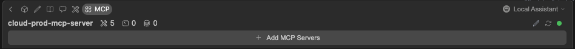
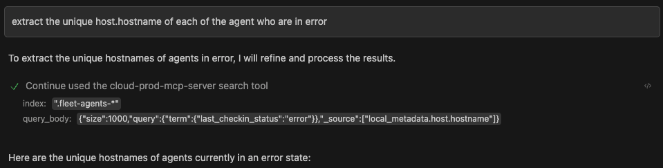
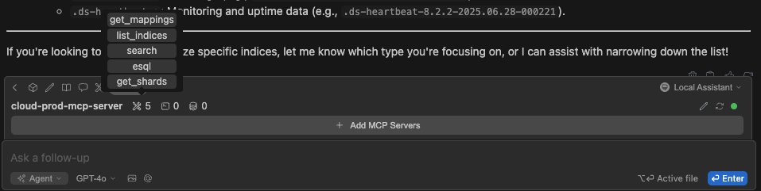

# Experimentation of MCP with Elasticsearch

<!-- vscode-markdown-toc -->
* 1. [Connect VSCode to Elasticsearch using MCP](#ConnectVSCodetoElasticsearchusingMCP)
	* 1.1. [Prerequisites](#Prerequisites)
	* 1.2. [Configuration](#Configuration)
	* 1.3. [Tips](#Tips)
		* 1.3.1. [Know what features are supported](#Knowwhatfeaturesaresupported)

<!-- vscode-markdown-toc-config
	numbering=true
	autoSave=true
	/vscode-markdown-toc-config -->
<!-- /vscode-markdown-toc -->

##  1. <a name='ConnectVSCodetoElasticsearchusingMCP'></a>Connect VSCode to Elasticsearch using MCP

During this research, we are going to use vscode along with the extension _continue_ to interact with MCP servers.

###  1.1. <a name='Prerequisites'></a>Prerequisites

- [ ] Download and install [_VSCode_](https://code.visualstudio.com/download)
- [ ] Download and install [_continue_](https://marketplace.visualstudio.com/items?itemName=Continue.continue) in vscode
- [ ] Download and install _Docker_ or npm

###  1.2. <a name='Configuration'></a>Configuration

1. open a new chat in continue
2. in the tool bar click on _MCP_ and _Add MCP Servers_. It will create a Yaml file inside the local project folder _.continue/mcpServers_. If you want to configure it globally, you can setup the Yaml file under your home directory (eg. ~/.continue/config.yaml)
3. once the file is created you can use the docker or the npm version by pasting and adapting the following examples:

**NPM**

```yaml
name: Elastic Cloud Production mcpServer
version: 0.0.1
schema: v1
mcpServers:
  - name: "cloud-prod-mcp-server"
    command: npx
    args:
      - -y
      - "@elastic/mcp-server-elasticsearch"
    env: {
      "ES_URL": "<ES_URL>",
      "ES_API_KEY": "<ES_API_KEY>",
      "ES_VERSION":"8",
      "OTEL_EXPORTER_OTLP_ENDPOINT":"<ES_APM_URL>", #Not supported yet
      "OTEL_EXPORTER_OTLP_HEADERS":"Authorization=Bearer <ES_APM_TOKEN>",  #Not supported yet
      "OTEL_METRICS_EXPORTER":"otlp",  #Not supported yet
      "OTEL_LOGS_EXPORTER":"otlp",  #Not supported yet
      "OTEL_RESOURCE_ATTRIBUTES":"service.name=elasticsearch-MCP,service.version=0.4.0,deployment.environment=dev",  #Not supported yet
      "OTEL_LOG_LEVEL":"info"  #Not supported yet
    }
```

**Docker**

```yaml
name: Elastic Cloud Production mcpServer
version: 0.0.1
schema: v1
mcpServers:
  - name: "cloud-prod-mcp-server"
    command: docker
    args:
      - run
      - -i
      - --rm
      - --name
      - es_mcp
      - -e
      - ES_URL
      - -e
      - ES_API_KEY
      - -e
      - ES_VERSION
      - -e
      - OTEL_EXPORTER_OTLP_ENDPOINT
      - -e
      - OTEL_EXPORTER_OTLP_HEADERS
      - -e
      - OTEL_METRICS_EXPORTER
      - -e
      - OTEL_LOGS_EXPORTER
      - -e
      - OTEL_RESOURCE_ATTRIBUTES
      - -e
      - OTEL_LOG_LEVEL
      - docker.elastic.co/mcp/elasticsearch
      - stdio
    env: {
      "ES_URL": "<ES_URL>",
      "ES_API_KEY": "<ES_API_KEY>",
      "ES_VERSION":"8",
      "OTEL_EXPORTER_OTLP_ENDPOINT":"<ES_APM_URL>", #Not supported yet
      "OTEL_EXPORTER_OTLP_HEADERS":"Authorization=Bearer <ES_APM_TOKEN>",  #Not supported yet
      "OTEL_METRICS_EXPORTER":"otlp",  #Not supported yet
      "OTEL_LOGS_EXPORTER":"otlp",  #Not supported yet
      "OTEL_RESOURCE_ATTRIBUTES":"service.name=elasticsearch-MCP,service.version=0.4.0,deployment.environment=dev",  #Not supported yet
      "OTEL_LOG_LEVEL":"info"  #Not supported yet
    }
```

> [!NOTE]
> I strongly suggest to use the docker as it's the most up to date and base on new code.

once one of the configuration is active, you will see the status turning into green as the example below.



If you are using the docker container and want to modify the configuration, you can kill the container using docker kill and click on the  button to restart a new container.

From there you can ask natural question to you elasticsearch server. For example :

1. list all the index from the prod server
2. extract the unique host.hostname of each of the agent who are in error



###  1.3. <a name='Tips'></a>Tips

####  1.3.1. <a name='Knowwhatfeaturesaresupported'></a>Know what features are supported

If you want to know what are the feature exposed by the MCP server, you can overlay your mouse to the continue toolbox like this :

